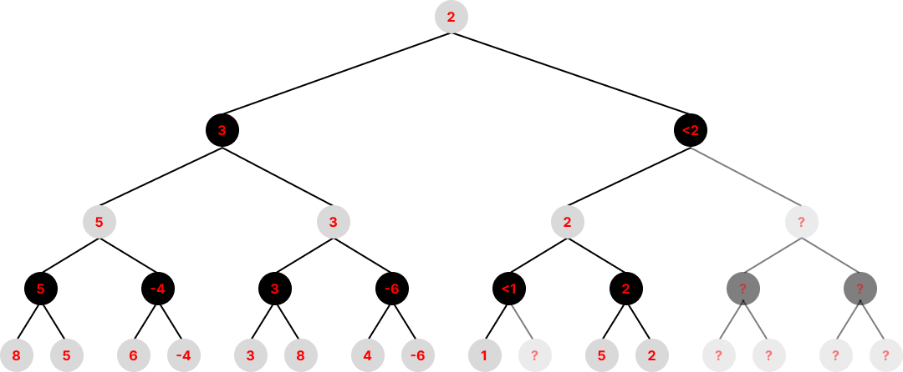

# Project: Minimax Algorithm with Alpha-Beta Pruning

## Project Description

This project implements the **Minimax algorithm with Alpha-Beta pruning**, a fundamental technique used in decision-making and game theory. The algorithm helps optimize decision-making in adversarial games like chess, tic-tac-toe, and checkers by minimizing the possible loss for a worst-case scenario.

### Algorithm Logic

The Minimax algorithm works by evaluating all possible moves in a game tree, assuming both players play optimally. Alpha-Beta pruning improves efficiency by eliminating branches that don't need to be explored, reducing computation time.

#### **Basic Minimax Steps:**
1. The algorithm recursively explores all possible moves up to a given depth.
2. It assigns values to terminal nodes based on a heuristic evaluation function.
3. It propagates these values back up the tree:
   - **Maximizing player** selects the highest value.
   - **Minimizing player** selects the lowest value.
4. The best move is selected at the root node.

#### **Alpha-Beta Pruning Optimization:**
- **Alpha (α):** Best value found for the maximizing player.
- **Beta (β):** Best value found for the minimizing player.
- If at any point, the current node's value exceeds β (for max player) or is lower than α (for min player), further exploration of that branch is stopped.

## Code Explanation
The implementation of the Minimax algorithm with Alpha-Beta pruning is structured as follows:

1. **Defining the Minimax function with Alpha-Beta pruning:**

   ```python
   def minimax(position, depth, alpha, beta, maximizingPlayer):
   ```

   - The function takes a game position, depth, alpha, beta, and a boolean indicating if it's the maximizing player's turn.

2. **Base case: Terminal node or depth limit reached:**

   ```python
   if depth == 0 or is_terminal(position):
       return evaluate(position)
   ```

   - If the search reaches the maximum depth or a terminal state, it returns the heuristic evaluation of the position.

3. **Maximizing player's turn:**

   ```python
   if maximizingPlayer:
       maxEval = float('-inf')
       for child in get_children(position):
           eval = minimax(child, depth-1, alpha, beta, False)
           maxEval = max(maxEval, eval)
           alpha = max(alpha, eval)
           if beta <= alpha:
               break
       return maxEval
   ```

   - Iterates through possible moves, updating α and pruning when possible.

4. **Minimizing player's turn:**

   ```python
   else:
       minEval = float('inf')
       for child in get_children(position):
           eval = minimax(child, depth-1, alpha, beta, True)
           minEval = min(minEval, eval)
           beta = min(beta, eval)
           if beta <= alpha:
               break
       return minEval
   ```

   - Iterates through possible moves, updating β and pruning when possible.

5. **Running the Minimax function:**

   ```python
   best_move = minimax(initial_position, max_depth, float('-inf'), float('inf'), True)
   ```

   - Calls the Minimax function on the initial game state with the maximum depth defined.

## How to Run the Project

### Requirements

- 🐍 Python 3.x installed

### Running the Code

1. 📥 Clone this repository:
   ```sh
   git clone https://github.com/oarthurfc/minimax.git
   cd minimax
   ```
2. ▶️ Run the main script:
   ```sh
   python main.py
   ```
3. 🎮 Choose a game scenario and observe the algorithm's decision-making.

## Asymptotic Complexity

### **Minimax without Alpha-Beta Pruning**

| Case         | Complexity      |
|-------------|----------------|
| ⚡ Best case | \(O(b^d)\)       |
| ⚡ Average case | \(O(b^d)\) |
| ⚡ Worst case | \(O(b^d)\) |

Where:
- **\( b \)** = branching factor (number of possible moves per turn)
- **\( d \)** = depth of the search tree

### **Minimax with Alpha-Beta Pruning**

| Case         | Complexity      |
|-------------|----------------|
| ⚡ Best case | \(O(b^{d/2})\) |
| ⚡ Average case | \(O(b^d)\) |
| ⚡ Worst case | \(O(b^d)\) |

By pruning unnecessary branches, the algorithm's performance improves, especially in favorable scenarios, reducing search complexity closer to \( O(b^{d/2}) \).

## Asymptotic Complexity Analysis Using Master Theorem

Given the recurrence:
\[
T(n) = 2T(n/2) + O(1)
\]

1. **Identifying values in the Master Theorem formula:**
   - \( a = 2 \), \( b = 2 \), \( f(n) = O(1) \)

2. **Calculating log_b a:**
   - \( p = \log_2 2 = 1 \)

3. **Determining the case of the Master Theorem:**
   - \( f(n) = O(1) = O(n^0) \) with \( c = 0 \) and \( p = 1 \), so **Case 1 applies**.

4. **Asymptotic solution:**
   - \( T(n) = O(n^1) = O(n) \)

### **Visual Diagram**



### **Conclusion**

- **Minimax without pruning** runs in **O(b^d)**, making it impractical for deep searches.
- **Alpha-Beta pruning** significantly optimizes performance, often reducing complexity to **O(b^{d/2})** in the best case.
- **The complexity of the MaxMin selection algorithm is O(n)** according to the Master Theorem.

## References

- 📚 [Minimax Algorithm - Wikipedia](https://en.wikipedia.org/wiki/Minimax)
- 📚 [Alpha-Beta Pruning - GeeksforGeeks](https://www.geeksforgeeks.org/minimax-algorithm-in-game-theory-set-4-alpha-beta-pruning/)

